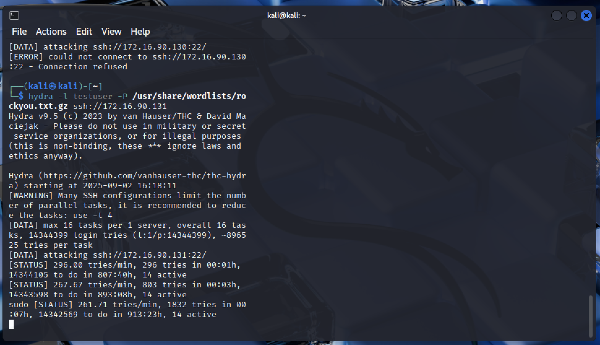
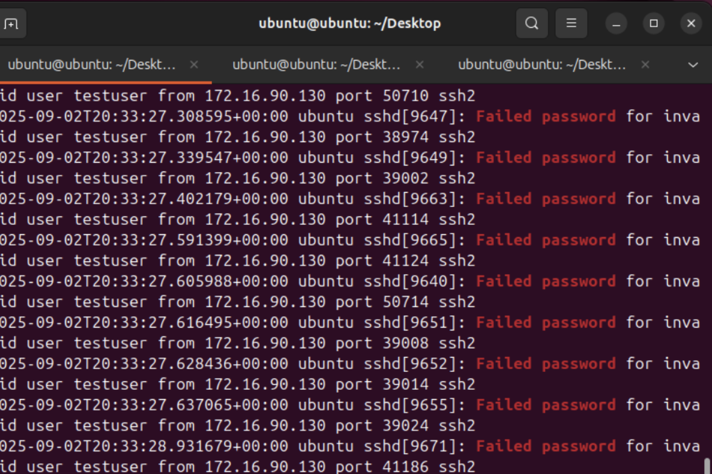
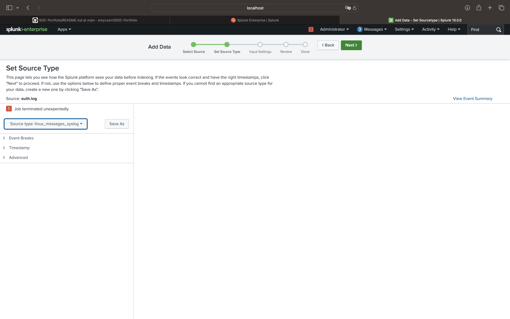
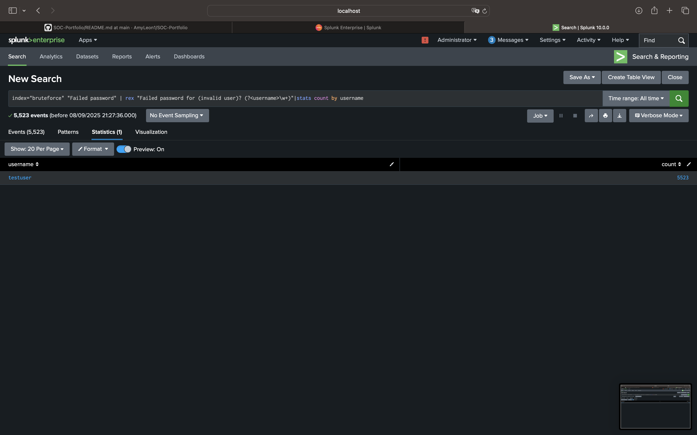
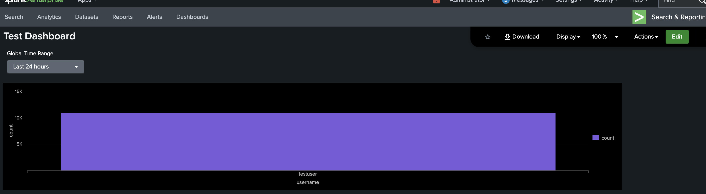
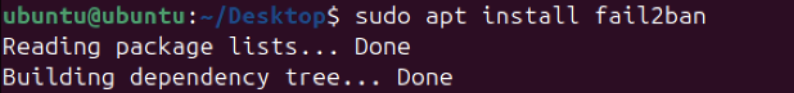

# Week 1 - Brute Force Detection with Splunk

This project demonstrates a simple SSH brute-force attack simulation using Hydra, and how to analyze it with Splunk for SOC-style reporting.

---

## 1. Attack Simulation
Hydra was used to perform a brute-force attack on the target Ubuntu VM.



---

## 2. Raw Logs
A snippet of the target system's auth.log showing failed login attempts.



---

## 3. Splunk Data Upload
The auth.log file was uploaded to Splunk, with Syslog source type and a dedicated `bruteforce` index.



---

## 4. Splunk Failed Login Events
Splunk search showing all failed login events from auth.log.




---

## 8. Mitigation with Fail2Ban

To prevent SSH brute-force attacks, I installed and configured [Fail2Ban](https://www.fail2ban.org/).  
Fail2Ban monitors log files for repeated failed login attempts and automatically bans offending IP addresses using firewall rules.  

### Installation


```bash
sudo apt update
sudo apt install fail2ban -y


